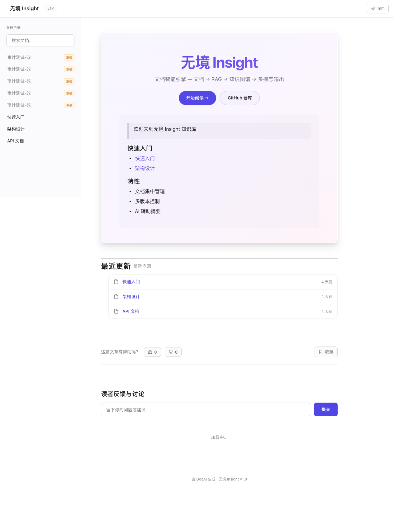
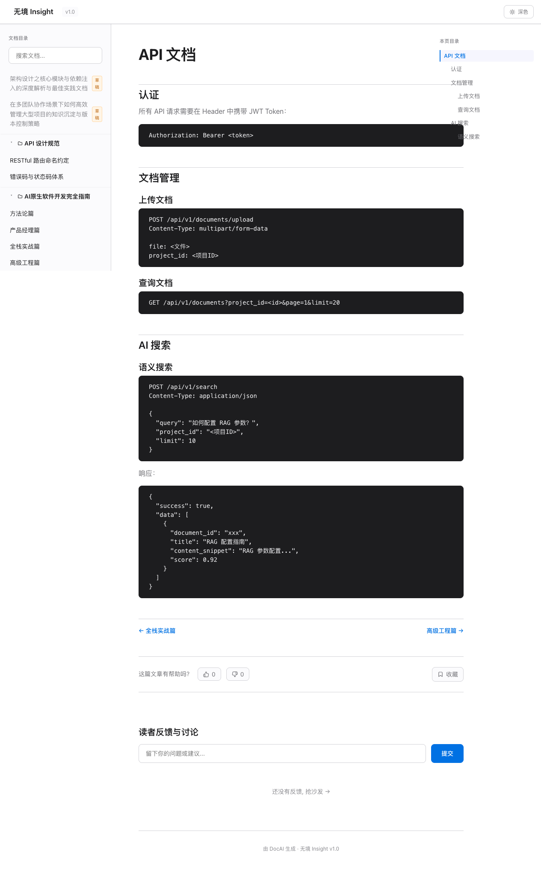
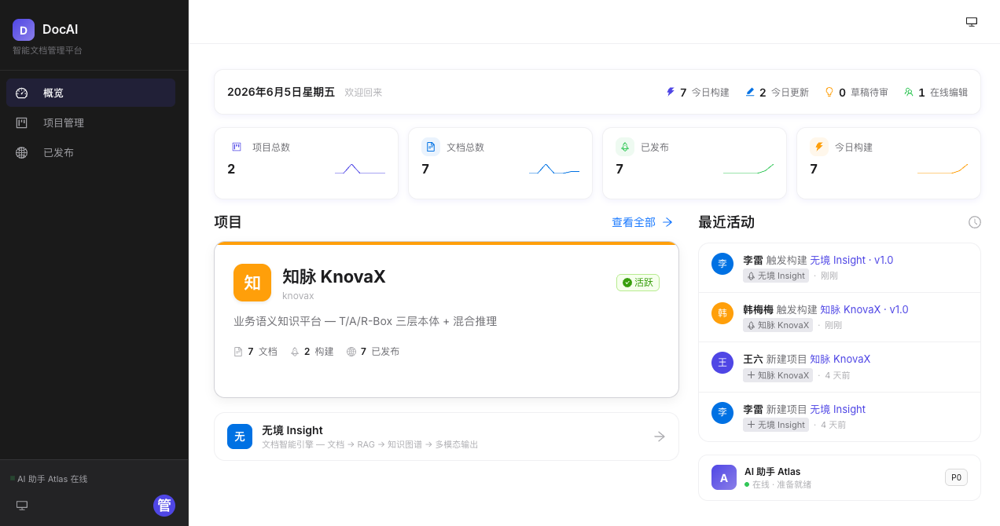

# OpenDocX — Documentation & Publishing for AI-Built Projects

> **The documentation, manual, and publishing layer for AI / Vibe Coding projects.**
>
> Turn a runnable AI-built project into something people can understand, operate, hand off, and publish.

<p align="center">
  <a href="LICENSE"></a>
  <a href="https://github.com/wangliu/opendocx/stargazers"></a>
  <a href="https://github.com/wangliu/opendocx/network/members"></a>
  <a href="https://github.com/wangliu/opendocx/issues"></a>
  <a href="https://github.com/wangliu/opendocx/blob/main/CHANGELOG.md"></a>
  <a href="https://github.com/wangliu/opendocx/actions"></a>
</p>

<p align="center">
  <a href="#-quick-start">Quick Start</a> ·
  <a href="#-core-features">Features</a> ·
  <a href="#-tech-stack">Tech Stack</a> ·
  <a href="CONTRIBUTING.md">Contributing</a> ·
  <a href="docs/OpenDocX-vs-Docusaurus-对标报告-2026-06-08.md">vs Docusaurus</a>
</p>

---

<p align="center">
  
</p>

<p align="center">
  <em>Above: A static documentation site generated by OpenDocX (dual theme: dark/light, Atlas EIDS design system)</em>
</p>

---

## Data Isolation (Read This First)

**Your local data is never pushed to GitHub:**
- `.env` (containing your `LLM_API_KEY`) is in `.gitignore`
- Your PostgreSQL database is **not in the repository** - cloning the repo gives you code, not data
- `data/builds/`, `data/uploads/`, `data/docs/` are all in `.gitignore`
- Your own documents, users, and audit logs stay on your machine

After cloning, run `bash scripts/seed_demo.sh` to create 1 demo project + 3 sample documents in your **own local database**. This is completely isolated from anyone else's data.

See [SECURITY.md](SECURITY.md#data-protection) for full details.

---

## Why OpenDocX?

[Docusaurus](https://docusaurus.io/) is the established, mature documentation framework (Meta-maintained, 65K stars). But it was designed for file-based authoring by teams that already have a documentation workflow.

OpenDocX focuses on a newer pain point: **AI and Vibe Coding make it easy to create a runnable project, but the last mile of project documentation is still messy**.

Most AI-built projects need more than a README before they can be shared:
- a project manual that explains the product, setup, usage, and operations
- API and deployment docs that stay close to the actual project
- a web admin surface for drafts, review, publishing, feedback, and audit logs
- a static site that can be shipped to users or teammates without extra tooling

OpenDocX is that documentation and publishing workspace.

| Pain Point | Docusaurus | OpenDocX |
|---|---|---|
| AI-built project handoff | Write Markdown in Git manually | **Web project manual + publishable static site** |
| Selection Q&A (LLM) | Need plugins + manual setup | **Select text → AI floating tip → streamed answer** |
| Draft management | Git branches + manual commits | **Web-based drafts, independent save** |
| Batch publish | CLI + git push | **One click → see doc tree → batch publish** |
| Live preview | `npm start` local server | **Browser-based edit + real-time render** |
| Multi-language | Crowdin pipeline (paid + config) | **Web admin i18n (zh/en toggle)** |
| Static site speed | 1 theme, manual dark mode setup | **Built-in dark/light dual theme + design tokens** |
| Search | Algolia (free tier) | Embedding semantic search (basic) |

**Important**: OpenDocX does **not** aim to dethrone Docusaurus. We don't compete on MDX, Algolia, or mature versioning. We go deeper on **AI-assisted project documentation, web admin, publish checks, and handoff workflows**.

Read our full [competitive analysis](docs/OpenDocX-vs-Docusaurus-对标报告-2026-06-08.md) (1万字, 7 sections).

---

## Core Features

### 1. AI-Native Three-Column Editor



- **Left**: Document tree (folders + docs, unlimited nesting)
- **Center**: Markdown editor with live preview (scrolling synced)
- **Right**: AI assistant panel (streamed responses, 6 actions)

### 2. AI Floating Tip

> *[Screenshot placeholder: AI floating tip showing 6 action options when text is selected. Please contribute a screenshot to `docs/screenshots/50-ai-floating-tip.png`]*

- **Select any text** → floating tip appears with 6 AI actions
- **SSE streaming** (Server-Sent Events, 30-60s long connection)
- **Accept/Reject modal**: See the result, decide whether to replace
- **Selection-aware Q&A** (v0.1.0): AI answers based on your selection, not the whole document

### 3. Command Palette (`Cmd K` / `Ctrl K`)

- Universal shortcut to open
- Jump to any page, create projects, upload, search
- Backend embedding search (RAG via sentence-transformers BAAI/bge-m3)

### 4. One-Click Static Site Generation

- `POST /api/v1/build/{version_id}` → complete HTML site
- **Output**: `data/builds/<project>/<version>/`
- **Supports**: Mermaid, Admonitions (7 types), Pygments (13 languages), images, video, iframes, dark mode, TOC, progress bar
- **Tested**: 143+ HTML files (vibe-coding-book project, 64 chapters + 2 placeholders)

### 5. Pre-Build Confirmation Modal (v0.1.0 Innovation)



> *[Screenshot placeholder: Actual R15 pre-build modal showing stats + tree + per-doc publish button + bulk publish checkboxes. Please contribute to `docs/screenshots/51-prebuild-modal.png`]*

- Click "Build" → **not direct build** → first see the doc tree
- Top stats: N total / Published / Draft / Empty
- (a) **Single "Publish" button** per draft row
- (b) **"Save & Publish" button** when current doc has unsaved changes
- Multi-select checkbox + "Select all unpublished" + "Bulk publish selected (N)"

### 6. Full RBAC + Audit

- 3 roles: admin / editor / viewer
- All admin mutations log to `audit_logs` table
- `/admin/audit` page for log viewing (filterable)
- `/admin/users` for user management (password change, role change, disable)

### 7. Internationalization (i18n)

- **Admin UI**: Chinese / English toggle (AntD LocaleProvider)
- **Static site output**: One project per language (see [ROADMAP.md](docs/ROADMAP.md#why-not-compete-with-docusaurus) for why)

### 8. Design System

- 9-color palette (L1-L5 grayscale + A1-A4 accents)
- Glassmorphism + floating pills + secondary menus
- Light / Dark dual theme (CSS variables)
- **No emoji in UI text** (we use SVG / Chinese / plain text)

---

## Quick Start (4 steps, 5 minutes)

### Prerequisites

- Python 3.9+ (3.12 recommended)
- Node.js 18+
- PostgreSQL 14+ (with `pgvector` extension)
- Redis 6+

### 1. Clone + Start Database

```bash
git clone https://github.com/wangliu/opendocx.git
cd opendocx

# PostgreSQL (example: docker)
docker run -d --name opendocx-pg -p 5432:5432 \
  -e POSTGRES_PASSWORD=opendocx \
  -e POSTGRES_DB=opendocx \
  pgvector/pgvector:pg16

# Redis
docker run -d --name opendocx-redis -p 6379:6379 redis:7-alpine
```

### 2. Start Backend

```bash
cd backend
python3 -m venv venv
source venv/bin/activate
pip install -r requirements.txt

cp ../.env.example ../.env
# Edit .env: fill in LLM_API_KEY / DATABASE_URL / REDIS_URL

bash scripts/start-backend.sh   # auto-sources .env
# → http://127.0.0.1:8001
```

### 3. Start Frontend

```bash
cd frontend
npm install
npx vite --host 127.0.0.1 --port 3077
# → http://127.0.0.1:3077
```

### 4. Login

Open http://127.0.0.1:3077. Default admin:
- **Email**: `admin@opendocx.local`
- **Password**: `admin123`


After login, click "New Project" → choose template → start writing. Select any text in the editor to trigger the AI floating tip.

> **Tip**: For a richer AI experience, configure an OpenAI-compatible endpoint (OpenAI / DeepSeek / Xiaomi mimo all work).

### 5. Seed Demo Data (Optional)

If you skipped the manual setup and want demo data:

```bash
bash scripts/seed_demo.sh
# Creates: 1 admin + 1 demo project + 3 sample docs
```

---

## Tech Stack

| Layer | Technology |
|---|---|
| Backend | Python 3.12 · FastAPI · SQLAlchemy 2.0 (async) · asyncpg |
| Frontend | React 18 · TypeScript · Ant Design 5 · Vite 6 · Zustand |
| Database | PostgreSQL 16 + pgvector · Redis 7 |
| AI | sentence-transformers (BAAI/bge-m3) · OpenAI-compatible LLM |
| Static Site | mistune · pygments · bleach · Mermaid · custom admonition renderer |
| Deploy | Docker Compose · Nginx |
| Testing | pytest + pytest-asyncio + httpx (10 backend test files) |

**Code metrics (v0.1.0):**
- Backend: 6,567 LOC
- Frontend: 8,897 LOC
- Total: 15,464 LOC

---

## Documentation

| Document | Audience |
|---|---|
| [README.md](README.md) | Everyone (you are here) |
| [docs/USER-GUIDE.md](docs/USER-GUIDE.md) | End users of OpenDocX |
| [docs/API.md](docs/API.md) | Developers integrating with the API |
| [docs/ARCHITECTURE.md](docs/ARCHITECTURE.md) | Developers modifying OpenDocX |
| [docs/PRD.md](docs/PRD.md) | Product managers |
| [docs/ROADMAP.md](docs/ROADMAP.md) | Future plans |
| [CHANGELOG.md](CHANGELOG.md) | Version history |
| [CONTRIBUTING.md](CONTRIBUTING.md) | Code contributors |
| [CODE_OF_CONDUCT.md](CODE_OF_CONDUCT.md) | Community standards |
| [SECURITY.md](SECURITY.md) | Vulnerability reporting |
| [docs/OpenDocX-vs-Docusaurus-对标报告-2026-06-08.md](docs/OpenDocX-vs-Docusaurus-对标报告-2026-06-08.md) | Competitive analysis |
| [docs/screenshots/](docs/screenshots/) | 58+ product screenshots |

---

## Known Limitations

OpenDocX v0.1.0 is a public alpha. The core workflow is usable, but these areas are intentionally not presented as production-complete yet:

- No frontend test suite yet; backend has pytest coverage for core APIs and rendering.
- Static-site Markdown is stronger than the admin editor preview by design, but formulas/KaTeX and MDX are still roadmap items.
- Real-time collaborative editing is not implemented; last save wins.
- Search is basic semantic search, not hybrid BM25 + vector ranking yet.
- Some legacy internal identifiers may remain temporarily for backward compatibility.

---

## Roadmap

See [ROADMAP.md](docs/ROADMAP.md) for the full plan. Key milestones:

### v0.1.0 (Current, 2026-06-08)

- 1-month development cycle wrapped
- R7-R15 polish (8 milestones, 7 commits)
- Full AI floating tip + Pre-Build Modal
- 11 demo projects / 143+ HTML files

### v0.2.0 (Planned, 2026-07)

- **AI in the static site** (chat widget, per-page explain)
- Live demo URL (Vercel/Railway deployment)
- Hacker News launch
- Chinese tech community posts (Juejin, Zhihu, SegmentFault)

### v0.3.0 (Exploration, 2026-Q3)

- MDX support (inspired by Docusaurus)
- Real-time collaboration (Yjs/CRDT)
- Editorial workflow (review, approval, comments)
- 5-10 real external users testing

### v1.0 (Target, 2026-Q4)

- 1000+ stars / 100+ users
- Full API stability
- Multi-tenant + commercial edition (if needed)

---

## Contributing

We welcome all forms of contribution! See [CONTRIBUTING.md](CONTRIBUTING.md).

**Quick start for contributors:**

1. **Fork + branch**: `git checkout -b feature/<short-name>`
2. **Make changes + verify**:
   - Backend: `cd backend && source venv/bin/activate && pytest tests/test_<x>.py -v`
   - Frontend: `cd frontend && npx tsc --noEmit`
3. **Commit** with a clear message explaining the root cause and your fix
4. **Push + Open PR** with verification evidence (test output, screenshots)

### Submitting Issues

- [Bug Report](https://github.com/wangliu/opendocx/issues/new?template=bug_report.md)
- [Feature Request](https://github.com/wangliu/opendocx/issues/new?template=feature_request.md)

### Submission Guidelines

- **Real data, no mocks** - Test with real API + real DB, not mocks
- **Root cause first** - In your PR description, state the actual root cause, not just "fixed a bug"
- **No emoji** - UI text uses SVG / Chinese / plain text
- **Document your changes** - Update relevant docs in the same PR
- **0 breaking changes** without a deprecation notice

---

## License

[Apache License 2.0](LICENSE) — commercial-friendly, allows commercial use, modification, and distribution.

---

## Acknowledgments

- [Docusaurus](https://docusaurus.io/) - Our competitor and inspiration
- [Ant Design](https://ant.design/) - UI component library
- [mistune](https://github.com/lepture/mistune) - Markdown parser
- [BAAI/bge-m3](https://huggingface.co/BAAI/bge-m3) - Embedding model
- [Vite](https://vitejs.dev/) - Frontend build tool
- All our early users and contributors (to be listed in v0.2.0)

---

<p align="center">
  <sub>Built with care by the OpenDocX community</sub>
</p>
