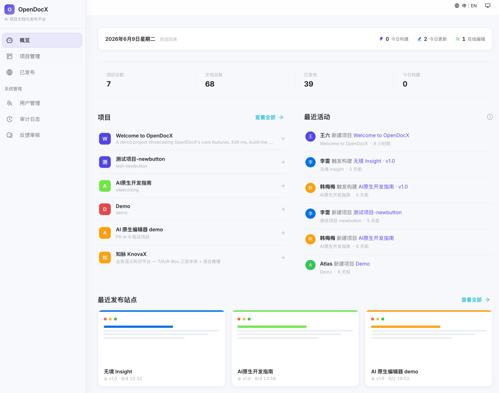
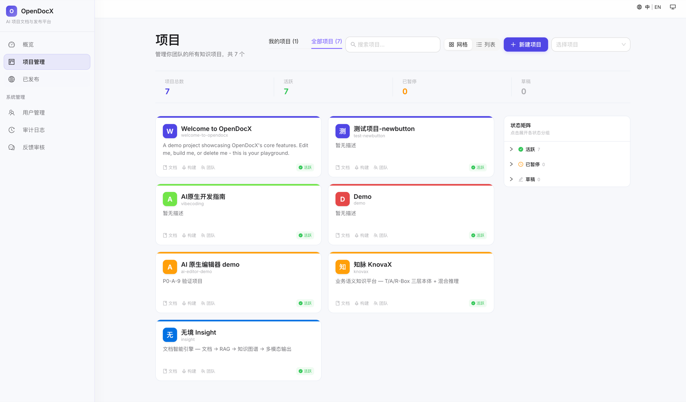
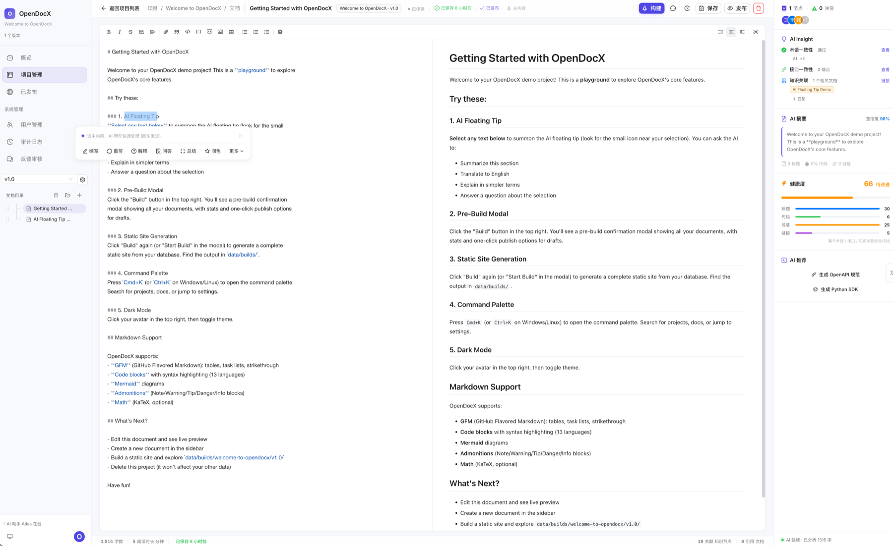
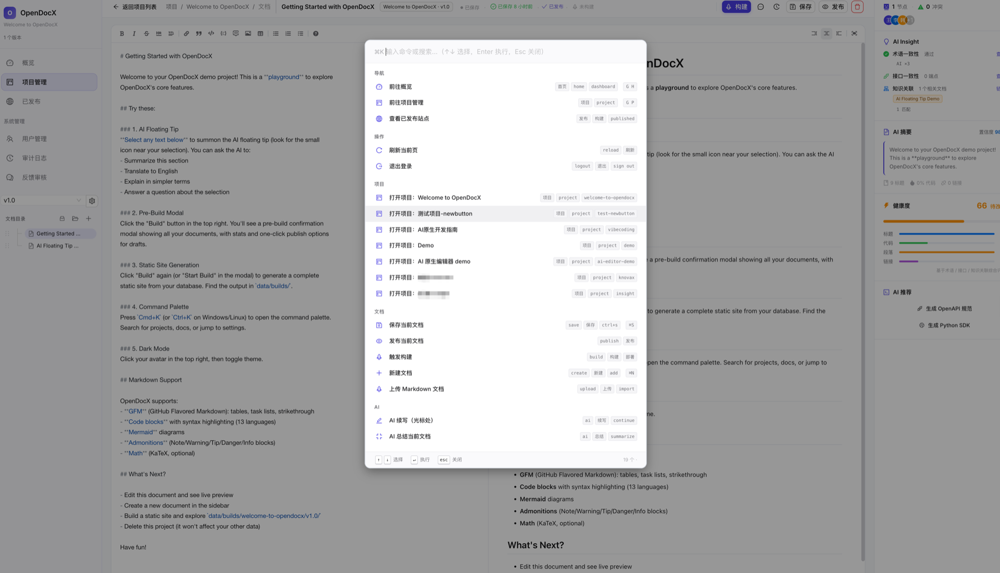
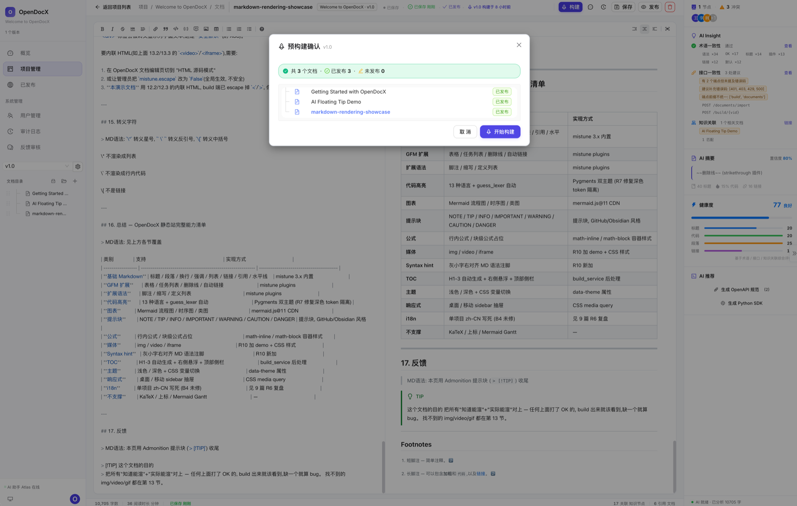
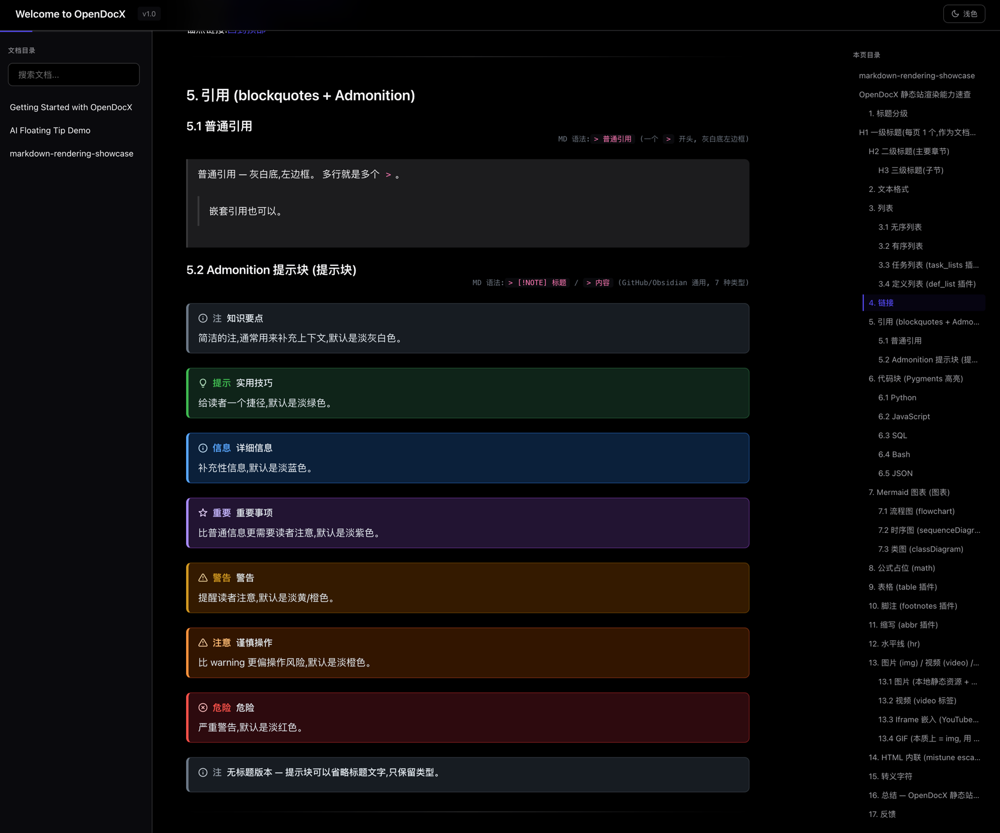
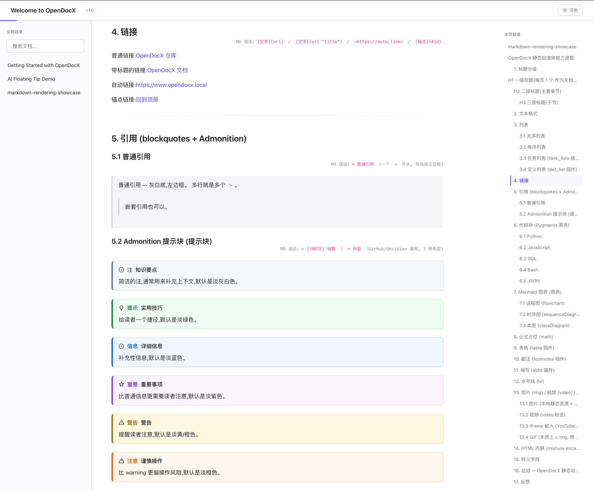
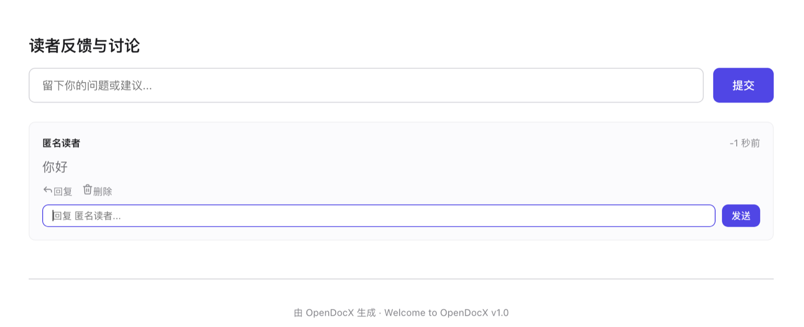

# OpenDocX 用户指南

这份指南面向第一次使用 OpenDocX 的用户，覆盖从登录、创建项目、编辑文档到构建静态站的完整流程。

## 1. 登录

执行 `bash scripts/seed_demo.sh` 后，本地环境会创建默认管理员：

```text
admin@opendocx.local / admin123
```

前端地址：

```text
http://localhost:3077
```

Docker 部署时同样使用该地址。

## 2. 首页

登录后进入后台首页。首页用于快速查看：

- 项目数量、文档数量、发布状态和最近构建。
- 最近更新的项目与文档。
- 待处理反馈、审计动向和常用入口。



## 3. 项目

项目是 OpenDocX 的核心工作空间。一个项目通常对应一个产品、一个开源库、一个客户交付包或一套业务手册。

在项目页可以：

- 新建项目。
- 编辑项目名称、标识、描述和主题色。
- 进入项目详情。
- 查看文档数量、版本、构建状态。
- 删除或归档项目。



## 4. 版本

每个项目至少有一个默认版本。版本用于承载同一项目在不同阶段的文档集合，例如：

- `v1.0`
- `v1.1`
- `internal`
- `public-alpha`

v0.1.0-alpha 已有版本数据结构，静态站构建默认使用当前版本。

## 5. 文档树

文档树支持文件夹和文档两类节点。

- 文件夹用于组织结构。
- 文档用于承载 Markdown 内容。
- 文档可以发布或保持草稿。
- 构建静态站时只输出已发布文档。

当前版本保留拖拽排序和层级调整。对于复杂目录，后续会增加更稳定的“移动到文件夹”操作，降低拖拽误差。

## 6. Markdown 编辑



编辑页采用三栏结构：

- 左侧：文档树。
- 中间：Markdown 编辑器。
- 右侧：预览和 AI 辅助面板。

后台编辑器的目标是高效录入和快速修改，不追求与静态站完全一致的阅读排版。静态站渲染链会提供更完整、更美观的阅读体验。

支持的 Markdown 能力包括：

- 标题、段落、引用、列表、链接。
- 表格、任务列表、删除线。
- 代码块和语法高亮。
- 图片、GIF、视频链接。
- 文档资产库：上传图片、视频和常见附件，并一键插入 Markdown 引用；静态站构建时会复制到站点 `assets/` 目录。
- 信息、提示、警告、危险等提示块。
- Mermaid 与公式的容器级美化。

完整示例见：

```text
examples/markdown-rendering-showcase.md
```

## 7. AI 辅助

OpenDocX 支持两类 AI 辅助：

- 选中文本后的浮层操作。
- 右侧 AI 面板的上下文辅助。

常见操作：

- 续写。
- 改写。
- 摘要。
- 翻译。
- 解释。
- 问答。

AI 服务通过 `.env` 配置。可以使用 OpenAI，也可以使用兼容 OpenAI API 风格的服务。



## 8. 发布状态

文档通常有两种状态：

- 草稿：只在后台可见，不进入静态站。
- 已发布：构建静态站时会输出。

构建前，OpenDocX 会展示发布确认，帮助你检查哪些文档会进入站点、哪些文档仍然是草稿。



## 9. 构建静态站

点击构建后，系统会从数据库读取已发布文档，生成纯静态站点。

输出目录通常是：

```text
data/builds/<project>/<version>/
```

静态站包含：

- HTML 页面。
- CSS 主题与阅读样式。
- 少量前端脚本。
- 搜索入口、主题切换、阅读进度。
- 反馈入口。





## 10. 反馈审核

静态站读者可以提交反馈。后台反馈页用于：

- 查看反馈内容。
- 查看来源文档。
- 判断是否垃圾反馈。
- 标记处理状态。

v0.1.0-alpha 已具备基础审核能力，后续会增强筛选、导出和通知。



## 11. 用户管理与审计

管理员可以进入用户管理页维护用户：

- 新建用户。
- 修改角色。
- 启用或禁用账号。
- 重置密码。

审计日志会记录关键操作，例如登录、项目修改、文档发布、构建、用户变更等。

## 12. 常见问题

### 登录失败怎么办？

先确认已经执行：

```bash
bash scripts/seed_demo.sh
```

默认账号是：

```text
admin@opendocx.local / admin123
```

如果你改过密码，可以重新清理本地数据库或在数据库里重置该用户。

### 为什么后台预览和静态站效果不完全一样？

这是有意设计。后台编辑器强调编辑效率、响应速度和工具栏操作；静态站强调最终阅读体验、代码高亮、提示块、表格、媒体和版式。

### 可以多人同时编辑吗？

v0.1.0-alpha 还没有 Google Docs 式实时协同，但已经提供基础冲突保护。编辑器打开文档时会记录当前 `revision`，保存时如果发现服务器版本已被其他人更新，会弹出冲突确认窗口，展示“服务器最新版本”和“我的编辑副本”的差异。

你可以选择载入服务器版本、把自己的修改另存为副本，或手动调整合并后的 Markdown 再保存。这样可以避免多人同时编辑时静默覆盖内容。

### 可以直接部署静态站吗？

可以。构建产物是纯静态文件，可以放到 Nginx、对象存储、GitHub Pages 或任意静态托管服务中。

### 支持英文项目吗？

可以。OpenDocX 后台界面以中文为主，文档内容可以是任意语言。多语言站点建议在 v0.1.0-alpha 先用不同项目或不同版本管理。
