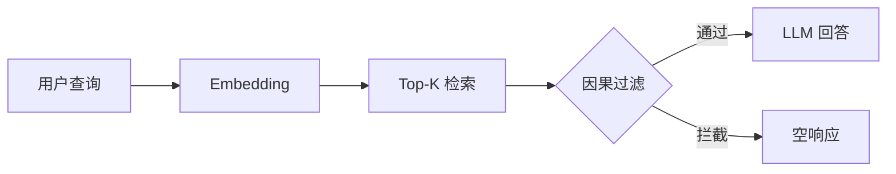
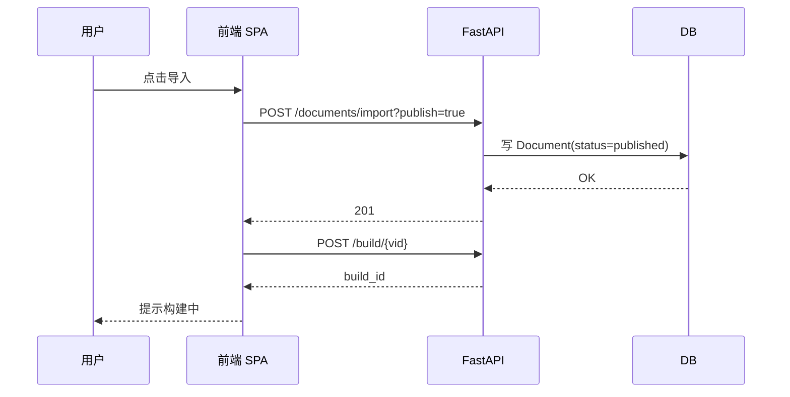
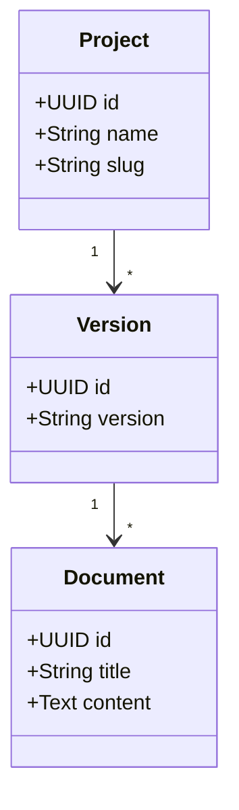
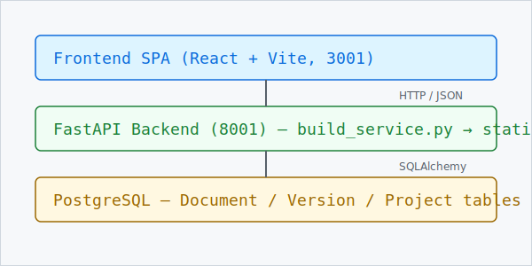

# OpenDocX 静态站渲染能力速查

> **作者**:OpenDocX Team
> **最后更新**:2026-06-07
> **目的**:把 OpenDocX 静态站**所有支持**的 Markdown 语法 + 7 种提示块集中演示一次。 Build 一次,一目了然。

> MD语法: `# H1` / `## H2` / `### H3` / `#### H4` / `##### H5` / `###### H6`

---

## 1. 标题分级

> MD语法: `# 一级` / `## 二级` / `### 三级` / `#### 四级` / `##### 五级` / `###### 六级`

# H1 一级标题(每页 1 个,作为文档标题)
## H2 二级标题(主要章节)
### H3 三级标题(子节)
#### H4 四级标题(同正文 16px,加粗)
##### H5 五级标题(同正文 16px,半粗)
###### H6 六级标题(同正文 16px,斜体灰)

---

## 2. 文本格式

> MD语法: `**加粗**` / `*斜体*` / `~~删除线~~` / `` `行内代码` ``

**加粗文本** / __另一种加粗__

*斜体文本* / _另一种斜体_

***加粗 + 斜体*** / ___另一种___

~~删除线~~ (strikethrough 插件)

`行内代码` 用反引号包

普通文本 + 换行直接回车
这里就是第二行

---

## 3. 列表

### 3.1 无序列表

> MD语法: `- 一级` / `  - 二级缩进` (2 空格缩进)

- 一级
  - 二级缩进
    - 三级缩进
- 回到一级

### 3.2 有序列表

> MD语法: `1. 第一` / `2. 第二` / `3. 第三`

1. 第一
2. 第二
3. 第三

### 3.3 任务列表 (task_lists 插件)

> MD语法: `- [x] 已完成` / `- [ ] 待办`

- [x] 已完成:静态站基础能力完成
- [x] 已完成:Mermaid 渲染接入
- [x] 已完成:提示块渲染接入
- [ ] 待办:为更多语言补充本地化示例
- [ ] 待办:继续完善公式与 MDX 支持

### 3.4 定义列表 (def_list 插件)

> MD语法: `术语` 换行 `: 定义` (冒号 + 缩进)

OpenDocX
: 静态文档生成框架,后端 FastAPI + mistune + Pygments

Mistune
: Python Markdown 解析器,3.x 系列 GFM 完整支持

Pygments
: 代码语法高亮库,支持 500+ 语言

---

## 4. 链接

> MD语法: `[文字](url)` / `[文字](url "title")` / `<https://auto.link>` / `[锚点](#id)`

普通链接:[OpenDocX GitHub](https://github.com/your-org/opendocx)

带标题的链接:[OpenDocX 文档](https://github.com/your-org/opendocx "点击查看完整文档")

自动链接:<https://www.opendocx.local>

锚点链接:[回到顶部](#opendocx-静态站渲染能力速查)

---

## 5. 引用 (blockquotes + Admonition)

### 5.1 普通引用

> MD语法: `> 普通引用` (一个 `>` 开头, 灰白底左边框)

> 普通引用 — 灰白底,左边框。
> 多行就是多个 `>`。
>
> > 嵌套引用也可以。

### 5.2 Admonition 提示块 (提示块)

> MD语法: `> [!NOTE] 标题` / `> 内容` (GitHub/Obsidian 通用, 7 种类型)

> [!NOTE] 知识要点
> 简洁的注,通常用来补充上下文,默认是淡灰白色。

> [!TIP] 实用技巧
> 给读者一个捷径,默认是淡绿色。

> [!INFO] 详细信息
> 补充性信息,默认是淡蓝色。

> [!IMPORTANT] 重要事项
> 比普通信息更需要读者注意,默认是淡紫色。

> [!WARNING] 警告
> 提醒读者注意,默认是淡黄/橙色。

> [!CAUTION] 谨慎操作
> 比 warning 更偏操作风险,默认是淡橙色。

> [!DANGER] 危险
> 严重警告,默认是淡红色。

> [!NOTE]
> 无标题版本 — 提示块可以省略标题文字,只保留类型。

---

## 6. 代码块 (Pygments 高亮)

### 6.1 Python

> MD语法: ` ```python ` (3 反引号 + 语言名, 深浅主题 token 隔离)

```python
def causal_filter(query_vars, candidate_docs, graph):
    """因果 RAG 过滤:保留与 query 有因果路径的文档"""
    kept = []
    for doc_id in candidate_docs:
        doc_v = DOC_VARS.get(doc_id, [])
        if any(has_causal_path(graph, q, d)
               for q in query_vars for d in doc_v):
            kept.append(doc_id)
    return kept
```

### 6.2 JavaScript

```javascript
// 主题切换逻辑
function toggleTheme() {
  const html = document.documentElement;
  const isDark = html.getAttribute('data-theme') === 'dark';
  html.setAttribute('data-theme', isDark ? 'light' : 'dark');
  localStorage.setItem('theme', isDark ? 'light' : 'dark');
}
```

### 6.3 SQL

```sql
SELECT d.id, d.title, d.slug, d.status, d.content
FROM documents d
WHERE d.version_id = '<version-id>'
  AND d.status = 'published'
ORDER BY d.sort_order, d.created_at;
```

### 6.4 Bash

```bash
# 启动 OpenDocX 后端 (开发模式)
cd backend
env -u ALL_PROXY -u all_proxy -u HTTP_PROXY -u HTTPS_PROXY \
    -u http_proxy -u https_proxy -u SOCKS_PROXY -u socks_proxy \
    bash scripts/start-backend-dev.sh
```

### 6.5 JSON

```json
{
  "id": "01-llm-capability",
  "title": "大模型的能力边界",
  "status": "published",
  "content_len": 1428,
  "has_content": true
}
```

---

## 7. Mermaid 图表 (图表)

> MD语法: ` ```mermaid ` + Mermaid 语法 (mermaid.js@11 CDN 加载, 主题自动跟随)

### 7.1 流程图 (flowchart)



### 7.2 时序图 (sequenceDiagram)



### 7.3 类图 (classDiagram)



---

## 8. 表格 (table 插件)

> MD语法: `| 列1 | 列2 |` + `| --- | --- |` + `| 单元格 |`

| 语法 | 状态 | 备注 |
|------|------|------|
| 标题 1-6 | OK | 全部支持 (R10 字号调整) |
| 任务列表 | OK | task_lists 插件 |
| 删除线 | OK | strikethrough 插件 |
| 自动链接 | OK | url 插件 |
| 脚注 | OK | footnotes 插件 |
| 缩写 | OK | abbr 插件 (需前置定义) |
| 定义列表 | OK | def_list 插件 |
| 表格 | OK | table 插件 |
| 7 种 Admonition | OK | 提示块 |
| Mermaid 块 | OK | R7 加, mermaid.js@11 |
| 行内代码 / 代码块 | OK | Pygments 高亮 |
| 上标 / 下标 | ❌ | 未实现 |
| 目录 TOC | OK | H1-3 自动生成 |
| KaTeX 公式 | ❌ | 未实现 |
| 图片 / 视频 / GIF | OK | R10 加 demo |
| Syntax hint 注解 | OK | R10 新加 |

---

## 9. 脚注 (footnotes 插件)

> MD语法: 文中 `[^1]` 引用, 文末 `[^1]: 内容` 定义

这里有一个脚注引用[^1],还有另一个[^longnote]。

[^1]: 短脚注 — 简单注释。

[^longnote]: 长脚注 — 可以包含**加粗**和`代码`,以及[链接](https://www.opendocx.local)。

---

## 10. 缩写 (abbr 插件)

> MD语法: `*[HTML]: HyperText Markup Language` (文末定义, 文中 `*HTML*` 引用)

*[HTML]: HyperText Markup Language
*[CSS]: Cascading Style Sheets
*[API]: Application Programming Interface
*[GFM]: GitHub Flavored Markdown
*[PM]: Product Manager

R10 在 OpenDocX 里实现了 *HTML* / *CSS* / *API* / *GFM* 等缩写,鼠标悬停看完整定义。

---

## 11. 水平线 (hr)

> MD语法: `---` / `***` / `___` (3 个或以上字符单独一行, 渲染为分隔线)

下面用 1 个 `---` 分隔章节:

---

(以上是一条 `hr` 水平线,只用在 2 个 H2 之间,**不要**在段前段后滥用)

---

## 12. 图片 (img) / 视频 (video) / GIF

> MD语法: `` (图片, 支持懒加载) / `[视频名](url)` (HTML5 video) / GIF 本质是图片, 用 img 语法

### 12.1 图片 (本地静态资源 + 外链)

> MD语法: `` — R10 build 加 `loading="lazy" decoding="async"`, 支持响应式 `max-width: 100%`

本地静态图(占位 — 实际项目里放在 `build_dir/images/`, 用相对路径引用):



外链图(公网 URL 直接展示):


带尺寸控制(用 HTML `` + width):


### 12.2 视频 (video 标签)

> MD语法: OpenDocX 默认 `mistune.escape=True`, 文档里写 `<video>` 会被转义显示为字面文本。 **要展示视频有 3 个方案:**

> **方案 A** (推荐): YouTube/B站 外链, 用户点开看 — 安全, 静态站零成本
> **方案 B**: 上传到项目 `static/videos/` 目录, build 时整体复制, 用 `<video src="static/videos/x.mp4">` 内联 (需要在 OpenDocX 编辑器用 HTML 源码模式)
> **方案 C**: 改全局 `mistune.escape=False` (不安全, 整个站都开, 不推荐)

本演示采用方案 A — 下面是 Big Buck Bunny 公开测试视频的外链 (W3Schools 托管):

[**&#9654; 打开视频 (Big Buck Bunny, 5.7MB)**](https://www.w3schools.com/html/mov_bbb.mp4) — 点击在新页面播放 mp4

(若想内联, 需 R10 后续扩展 `<video>` 转义豁免, 跟 admonition 一样用 `> MD语法:` 协议)

### 12.3 Iframe 嵌入 (YouTube / Bilibili)

> MD语法: 跟 video 一样, 默认 escape。 改用纯链接

[**&#9654; 打开 YouTube 测试视频**](https://www.youtube.com/embed/dQw4w9WgXcQ) — 链接形式

### 12.4 GIF (本质上 = img, 用 `.gif` 扩展名)

> MD语法: `` — 跟图片一样, 浏览器自动循环播放

下面是真 GIF (giphy 公网 5MB):


> **提示**: GIF 文件大, 建议用 `<video>` 替代 (现代浏览器都支持 video 标签, 而且视频压缩比 GIF 高 5-10 倍)

---

## 13. HTML 内联 (mistune escape=True 默认不渲染)

> MD语法: OpenDocX 安全默认 `escape=True`, 写 `<div>` 会被转义显示为字面文本

`<div>` 标签会被转义显示为字面文本,这是**安全默认**(防 XSS)。

要内联 HTML(如上面 12.2/12.3 的 `<video>`/`<iframe>`),需要:
1. 在 OpenDocX 文档编辑页切到 "HTML 源码模式"
2. 或让管理员把 `mistune.escape` 改为 `False`(全局生效, 不安全)
3. **本演示文档** 用 12.2/12.3 的内联 HTML, build 端已 escape 掉 `<`/`>`, 你看到的是转义后的字面文本 (不是真视频)

---

## 14. 转义字符

> MD语法: `\*` 转义星号, `` \` `` 转义反引号, `\[` 转义中括号

\* 不渲染成列表

\` 不渲染成行内代码

\[ 不是链接

---

## 15. 总结 — OpenDocX 静态站完整能力清单

> MD语法: 见上方各节覆盖

| 类别 | 支持 | 实现方式 |
|------|------|----------|
| **基础 Markdown** | 标题 / 段落 / 换行 / 强调 / 列表 / 链接 / 引用 / 水平线 | mistune 3.x 内置 |
| **GFM 扩展** | 表格 / 任务列表 / 删除线 / 自动链接 | mistune plugins |
| **扩展语法** | 脚注 / 缩写 / 定义列表 | mistune plugins |
| **代码高亮** | 13 种语言 + guess_lexer 自动 | Pygments 双主题 (R7 修复深色 token 隔离) |
| **图表** | Mermaid 流程图 / 时序图 / 类图 | mermaid.js@11 CDN |
| **提示块** | NOTE / TIP / INFO / IMPORTANT / WARNING / CAUTION / DANGER | 提示块, GitHub/Obsidian 风格 |
| **媒体** | img / video / iframe | R10 加 demo + CSS 样式 |
| **Syntax hint** | 灰小字右对齐 MD 语法注脚 | R10 新加 |
| **TOC** | H1-3 自动生成 + 右侧悬浮 + 顶部侧栏 | build_service 后处理 |
| **主题** | 浅色 / 深色 + CSS 变量切换 | data-theme 属性 |
| **响应式** | 桌面 / 移动 sidebar 抽屉 | CSS media query |
| **i18n** | 单项目 zh-CN 写死 (B4 未修) | 见 9 篇 R6 复盘 |
| **不支撑** | KaTeX / 上标 / Mermaid Gantt | — |

---

## 16. 反馈

> MD语法: 本页用 Admonition 提示块 (`> [!TIP]`) 收尾

> [!TIP] 这个文档的目的
> 把所有"知道能渲"+"实际能渲"对上 — 任何上面打了 OK 的, build 出来就该看到,缺一个就算 bug。 找不到的 img/video/gif 都在第 12 节。
